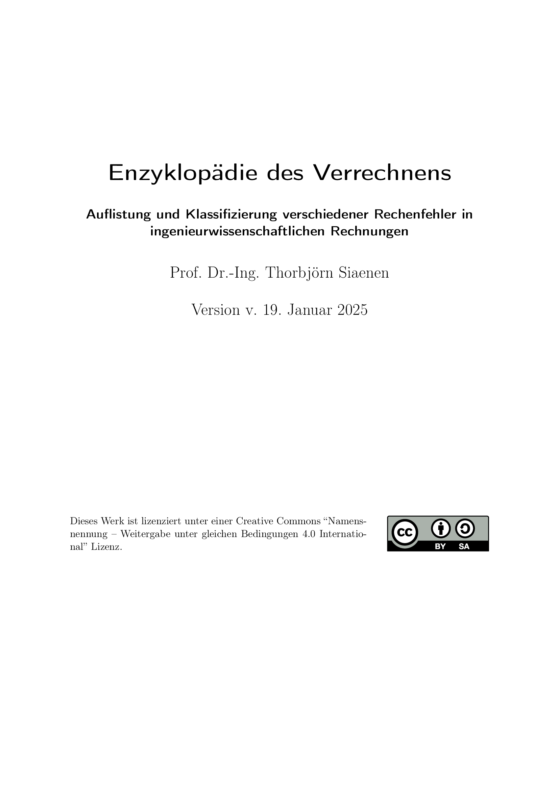

# Enzyklopädie des Verrechnens

Dieses Dokument ist eine Aufstellung häufig vorkommender Rechenfehler
in ingenieurwissenschaftlichen Berechnungen. Das Dokument ist 
unter "Open Source"-Bedingungen freigegeben (Lizenz CC-BY-SA International 4.0).
Alle sind eingeladen, das Dokument zu erweitern oder eventuell vorhandene
Verbesserungen einzupflegen.

Das Dokument ist mit dem Editor LyX [www.lyx.org](www.lyx.org) erstellt und soll damit 
auch weiter gepflegt werden.

Download der PDF-Datei: [https://github.com/drthorsia/EnzyklopaedieDesVerrechnens/blob/main/EnzyklopaedieDesVerrechnens.pdf](https://github.com/drthorsia/EnzyklopaedieDesVerrechnens/blob/main/EnzyklopaedieDesVerrechnens.pdf)

Vorschau:

